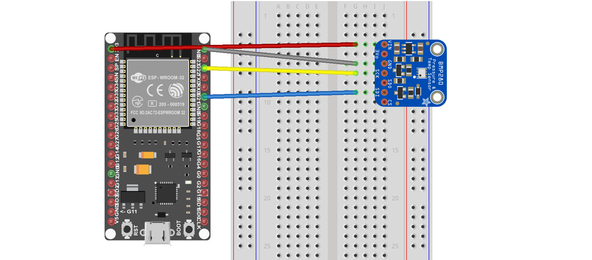

# BMP280 with NanoFramework on ESP32

One of the most common scenarios for IoT devices is detection of environmental conditions. A variety of sensors are available to monitor temperature, humidity, barometric pressure, and more.

This sample explains how you can use BMP280 Pressure & Temperature Semsor with .Net NanoFramework on ESP32

## Pins

The following are the connections from the ESP32 to the BME280 breakout:

* 3.3V to VIN OR 3V3 (shown in red)
* Ground to GND (grey)
* SDA (GPIO 21) to SDI (blue)
* SCL (GPIO 22) to SCK (yellow)